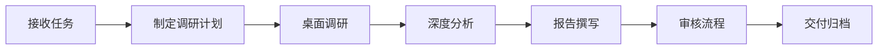

# 🔍 调研部 · Research Department

**部长：张明远** | 下属：5人（李雪晴、王思远、陈雨桐、刘浩然、周雅文）

## 部门定位
公司的核心业务部门，负责行业调研、信息搜集、报告撰写等基础研究工作，为分析和决策提供一手信息支撑。

## 工作流程

## 审核体系
调研部是一级审核（内容审核）的责任部门，部长张明远负责第一道质量关。

## 本仓库用途
- 📝 调研任务书与工作指派
- 📄 调研报告初稿与审核
- 📊 调研方法论文档
- 📋 待调研议题追踪

## 分派任务流程
1. CEO在此仓库创建 Issue 指派调研任务
2. 张明远部长拆分任务到研究员
3. 研究员提交 PR 附报告初稿
4. 部长审核 → 流转至分析部/CEO
