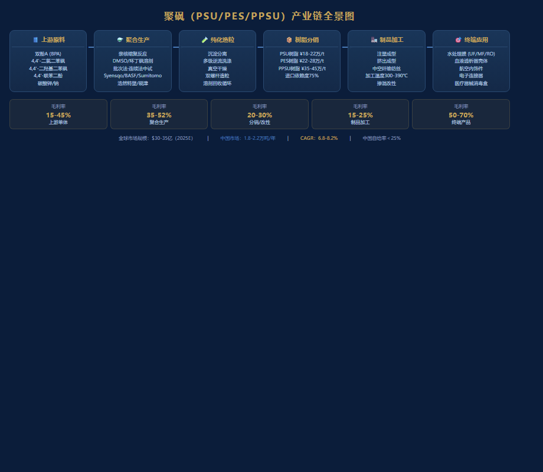
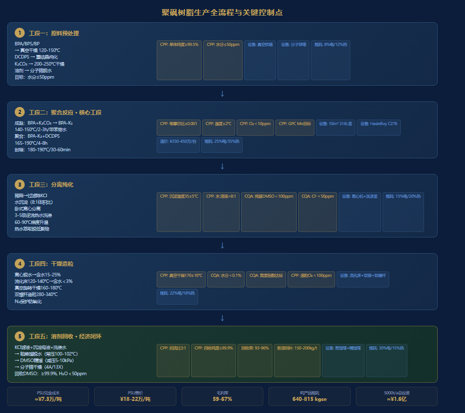

## 目录

## 1. 执行摘要

### 核心发现

**市场判断：** 聚砜类高聚物（PSU/PES/PPSU）作为特种工程塑料金字塔顶端材料，全球市场规模约28-35亿美元（2025年），年复合增长率6.8-8.2%。中国市场需求增速显著高于全球（12-15%），但国产化率不足25%，进口替代空间巨大。核心驱动力来自水处理膜（PES中空纤维膜）、医疗器械（PSU血液透析器壳体）和航空航天（PPSU轻量化结构件）三大领域。

**技术判断：** 聚砜生产工艺壁垒极高。核心难点在于：① 亲核芳香取代缩聚反应的精确控制（等摩尔比、无水无氧条件）；② 高分子量产品的聚合终点判断；③ 残留溶剂（DMSO/NMP/环丁砜）的ppm级脱除；④ 溶剂回收的经济性闭环。目前全球仅Solvay、BASF、Sumitomo三家掌握全链条量产技术，国内尚无企业实现稳定商业化量产。

**竞争判断：** Solvay（现Syensqo）以Udel®（PSU）、Radel®（PPSU）和Veradel®（PES）三大系列占据全球约55-60%市场份额。BASF的Ultrason®系列占比约15-18%。Sumitomo化学约8-10%。中国方面，山东浩然特塑、天津砚津科技、金发科技等正进行中试及小规模量产，但产品分子量分布、黄度指数、残留单体等关键指标与进口产品仍有差距。

**战略建议：** 建议分三阶段切入：**第一阶段（1-2年）**——聚焦PES水处理膜级树脂（技术门槛最低、需求最大），建设3000吨/年示范线，围绕DMSO溶剂回收体系建立工艺闭环；**第二阶段（3-4年）**——扩展至PSU医疗器械级，取得USP Class VI和ISO 10993认证；**第三阶段（5-6年）**——攻克PPSU航空级，产能扩至万吨级，实现全系列覆盖。

### 关键数字

| 指标 | 数值 |
|:------|:----:|
| 全球聚砜市场规模（2025E） | $30-35亿 |
| 中国市场年需求量 | 1.8-2.2万吨 |
| 国内生产能力 | ~5000吨/年 |
| 进口依赖度 | 75-80% |
| PSU树脂进口均价 | ¥18-22万/吨 |
| PES树脂进口均价 | ¥22-28万/吨 |
| PPSU树脂进口均价 | ¥35-45万/吨 |
| 单体BPA成本 | ¥8,000-12,000/吨 |
| 单体DCDPS成本 | ¥5.5-8万/吨 |
| 万吨级产线投资估算 | ¥12-18亿 |
| 溶剂回收率目标 | ≥95% |
| 产品毛利率（估算） | 35-52% |

\pagebreak

## 2. 产品/行业定义与核心特性

### 2.1 化学定义

聚砜（Polysulfone）类高聚物是指在分子主链上含有砜基（—SO₂—）和芳环结构的一类热塑性特种工程塑料。根据二酚单体的不同，主要分为三个品种：

| 品种 | 英文缩写 | 二酚单体 | 二氯单体 | 化学结构特征 |
|:------|:------|:------|:------|:------|
| 双酚A型聚砜 | PSU | 双酚A (BPA) | 4,4'-二氯二苯砜 (DCDPS) | 含异丙叉基（—C(CH₃)₂—） |
| 聚醚砜 | PES | 4,4'-二羟基二苯砜 (BPS) | DCDPS | 全芳醚砜结构，无脂肪链 |
| 聚苯砜 | PPSU | 4,4'-联苯二酚 (BP) | DCDPS | 含联苯结构，刚性最强 |

### 2.2 聚合反应化学

三种聚砜均通过**亲核芳香取代缩聚反应（Nucleophilic Aromatic Substitution Polycondensation）**合成。反应通式：

```
n HO—Ar—OH  +  n Cl—Ar'—SO₂—Ar'—Cl  +  M₂CO₃  ──→
    —[O—Ar—O—Ar'—SO₂—Ar']ₙ—  +  2n MCl  +  n CO₂  +  n H₂O
```

其中 M = Na 或 K（碳酸盐催化剂），Ar 为对应的二酚残基，Ar'为二苯砜残基。

**反应机理要点：**
- 碳酸钾/碳酸钠使二酚去质子化生成酚盐负离子（亲核试剂）
- 酚盐进攻DCDPS的对位氯取代位置，发生芳香亲核取代（SNAr）
- 砜基的强吸电子效应活化芳环上的氯离去基团
- 反应需在无水条件下进行，水会终止缩聚链增长
- 副产物为CO₂、H₂O和MCl（NaCl/KCl），无有机副产物产生

### 2.3 核心参数对比表

| 参数 | PSU (Udel®) | PES (Veradel®) | PPSU (Radel® R) |
|:------|:----:|:----:|:----:|
| Tg（玻璃化转变温度，℃） | 185-190 | 220-230 | 220-225 |
| 密度（g/cm³） | 1.24 | 1.37 | 1.29 |
| 拉伸强度（MPa） | 70-75 | 80-90 | 70-76 |
| 弯曲模量（GPa） | 2.7-2.8 | 2.6-2.9 | 2.4-2.5 |
| 热变形温度（1.82MPa，℃） | 174 | 204 | 207 |
| 吸水率（24h，%） | 0.22-0.30 | 0.60-0.80 | 0.37 |
| 氧指数（LOI，%） | 30 | 38 | 36 |
| UL94阻燃等级 | V-0 | V-0 | V-0 |
| 透明性 | 透明-淡琥珀 | 透明-淡琥珀 | 透明-淡琥珀 |
| 介电常数（1MHz） | 3.1 | 3.5 | 3.4 |

\pagebreak

## 3. 产业链/价值链分析

### 3.1 产业链全景



### 3.2 价值链利润分布

| 环节 | 毛利率 | 关键壁垒 |
|:------|:----:|:------|
| BPA单体生产 | 15-20% | 规模效应，技术成熟 |
| DCDPS单体生产 | 35-45% | 合成难度高，产能集中 |
| 聚砜树脂聚合 | 35-52% | 工艺know-how，品控难度 |
| 改性/共混造粒 | 20-30% | 配方技术，客户定制 |
| 制品加工（注塑/挤出） | 15-25% | 加工温度高（340-390℃） |
| 终端产品（医疗器械等） | 50-70% | 认证壁垒，品牌溢价 |

\pagebreak

## 4. 市场规模与增长预测

### 4.1 全球市场

| 年份 | 全球市场规模（亿美元） | 需求量（万吨） | 增长率 |
|:------|:----:|:----:|:----:|
| 2020 | 21.9 | 8.5 | — |
| 2022 | 25.3 | 9.8 | 7.5% |
| 2025E | 32.5 | 12.6 | 8.0% |
| 2028E | 44.0 | 16.8 | 7.8% |
| 2030E | 54.0 | 20.5 | 7.2% |

### 4.2 中国市场

| 年份 | 需求量（吨） | 国产供应（吨） | 进口量（吨） | 进口占比 |
|:------|:----:|:----:|:----:|:----:|
| 2020 | 8,500 | 1,200 | 7,300 | 85.9% |
| 2022 | 12,000 | 2,000 | 10,000 | 83.3% |
| 2025E | 20,000 | 4,500 | 15,500 | 77.5% |
| 2028E | 32,000 | 12,000 | 20,000 | 62.5% |
| 2030E | 45,000 | 22,000 | 23,000 | 51.1% |

### 4.3 分品种需求结构（中国，2025E）

| 品种 | 需求量（吨） | 占比 | 主要应用 |
|:------|:----:|:----:|:------|
| PES | 10,500 | 52.5% | 水处理膜、血液透析膜 |
| PSU | 6,500 | 32.5% | 医疗器械壳体、食品接触 |
| PPSU | 3,000 | 15.0% | 航空、高端电子 |

\pagebreak

## 5. 需求端深度分析

### 5.1 水处理膜（PES核心市场）

- **全球膜市场年增长：** 8-10%，PES膜因耐氯性优异，在UF/MF膜中占比持续提升
- **中国水处理膜需求：** ≈6,500吨 PES（2025E），占国内总需求62%
- **驱动因素：** 市政污水处理提标改造、工业废水零排放（ZLD）、海水淡化预处理
- **竞争材料：** PVDF（耐化学性更好但亲水性差，需改性）；PSF（机械强度好但Tg较低）

### 5.2 医疗器械（PSU核心市场）

- **血液透析器壳体：** 中国年透析患者约85万人（2025），年增12%，每名患者年均消耗约1.5kg PSU壳体
- **消毒盒/手术器械托盘：** 耐蒸汽灭菌（134℃循环），半透明便于器械识别
- **牙科/正畸器械：** 高强度、生物相容性好
- **认证门槛：** 需通过USP Class VI、ISO 10993生物相容性测试，认证周期18-36个月

### 5.3 航空航天（PPSU核心市场）

- **客舱内饰：** 替代铝合金和PC，减重30-40%，FST（阻燃/烟密度/毒性）性能优异
- **典型用量：** 波音787每架使用约200-300kg PPSU部件（座椅骨架、行李架组件、侧壁板连接件）
- **中国C919/C929需求：** C929宽体客机预计2030年前后投入运营，将显著拉动PPSU需求

### 5.4 电子电气

- **连接器/插座：** 耐温＞180℃，UL94 V-0自熄
- **电容器薄膜：** 高Tg、低介电损耗
- **锂电池隔膜涂覆：** PSU/PES涂覆提升热稳定性

\pagebreak

## 6. 竞争格局与情报

### 6.1 全球主要生产商

| 企业 | 品牌 | 品种 | 产能（吨/年） | 市占率 | 备注 |
|:------|:------|:------|:----:|:----:|:------|
| Syensqo（原Solvay） | Udel®/Radel®/Veradel® | PSU/PPSU/PES | ~45,000 | 55-60% | 美国Marietta工厂+印度Panoli |
| BASF | Ultrason® | PSU/PES/PPSU | ~18,000 | 15-18% | 德国Ludwigshafen |
| Sumitomo化学 | Sumikaexcel® | PES | ~5,000 | 5-7% | 日本Ehime |
| 山东浩然特塑 | — | PSU/PES | ~2,000 | 2-3% | 中国威海，扩产中 |
| 天津砚津科技 | — | PSU/PES | ~1,000 | 1-2% | 中试规模 |
| 金发科技 | — | PSU/PES | ~500 | <1% | 研发/小试 |

### 6.2 中国在建/规划产能

| 企业 | 规划产能（吨/年） | 目标品种 | 预计投产 |
|:------|:----:|:------|:------|
| 山东浩然特塑 | 5,000（二期） | PSU/PES/PPSU | 2027-2028 |
| 沃特股份 | 3,000 | PSU/PES | 2027 |
| 万华化学 | 3,000-5,000 | PSU/PES | 2028+ |
| 南京聚隆 | 2,000 | PSU/PES | 2027 |
| 同益股份 | 1,500 | PSU | 2026-2027 |

### 6.3 竞争壁垒分析

| 壁垒类型 | 难度评级 | 说明 |
|:------|:----:|:------|
| 单体纯度 | ★★★★☆ | DCDPS纯度需≥99.5%，异构体控制 |
| 等摩尔比控制 | ★★★★★ | 偏差＜0.1mol%才能获得高分子量 |
| 无水无氧条件 | ★★★★☆ | 水分＜50ppm，否则分子量骤降 |
| 溶剂回收纯化 | ★★★★☆ | 回收率＞95%才能经济性闭环 |
| 产品纯化 | ★★★★★ | 残留溶剂＜500ppm，残留单体＜100ppm |
| 批次一致性 | ★★★★☆ | 分子量波动＜±5% |
| 客户认证 | ★★★★★ | 医疗器械认证3-5年 |

\pagebreak

## 7. 生产工艺深度剖析

### 7.1 生产全流程总览



聚砜树脂生产工艺分为**五大工段**：

```
工段一：原料预处理    → 单体纯化、干燥、溶剂脱水
工段二：聚合反应      → 缩聚反应、分子量控制
工段三：产物分离纯化  → 聚合物沉淀、洗涤、残留脱除
工段四：干燥造粒      → 脱水干燥、造粒包装
工段五：溶剂回收      → 溶剂蒸馏纯化、循环复用、副产物处理
```

### 7.2 工段一：原料预处理

#### 7.2.1 主要原料规格

| 原料 | CAS号 | 规格要求 | 关键杂质控制 | 典型供应商 | 参考价格（¥/吨） |
|:------|:------|:------|:------|:------|:----:|
| 双酚A (BPA) | 80-05-7 | ≥99.9%, 聚碳级 | 游离酚＜50ppm, Fe＜0.5ppm | Covestro, 长春化工, 鲁西化工 | 8,000-12,000 |
| 4,4'-二氯二苯砜 (DCDPS) | 80-07-9 | ≥99.5% | 2,4'-异构体＜0.3%, 单氯杂质＜0.1% | 江苏吴帆, Vertellus, 浙江扬帆 | 55,000-80,000 |
| 4,4'-二羟基二苯砜 (BPS) | 80-09-1 | ≥99.5% | Fe＜1ppm, 灰分＜0.1% | 江苏吴帆, 寿光卫东 | 45,000-65,000 |
| 4,4'-联苯二酚 (BP) | 92-88-6 | ≥99.5% | 邻位异构体＜0.2% | SI Group, 本溪吉凯隆 | 120,000-180,000 |
| 碳酸钾 (K₂CO₃) | 584-08-7 | ≥99.8%, 无水级 | Cl⁻＜50ppm, 水分＜0.1% | 浙江大洋, 阿拉丁 | 8,000-10,000 |
| 碳酸钠 (Na₂CO₃) | 497-19-8 | ≥99.8%, 无水级 | Cl⁻＜50ppm | 山东海化 | 2,500-3,500 |
| 二甲基亚砜 (DMSO) | 67-68-5 | ≥99.9%, 无水级 | 水分＜100ppm | 湖北兴发, Gaylord | 12,000-18,000 |
| N-甲基吡咯烷酮 (NMP) | 872-50-4 | ≥99.9%, 电子级 | 水分＜100ppm, 胺值＜10ppm | 迈奇化学, BASF | 20,000-28,000 |
| 环丁砜 (Sulfolane) | 126-33-0 | ≥99.5%, 无水级 | 水分＜100ppm, 酸值＜0.1 | 辽阳石化, Chevron Phillips | 18,000-25,000 |
| 二苯砜 (Diphenyl Sulfone) | 127-63-9 | ≥99.0% | Fe＜2ppm | 江苏吴帆 | 30,000-40,000 |

#### 7.2.2 单体预处理流程

```
BPA/BPS/BP ──→ 真空干燥（120-150℃, <1kPa, 4-6h, 水分≤50ppm）
                       ↓
DCDPS     ──→ 重结晶/熔融结晶纯化 → 真空干燥（80-100℃）
                       ↓
K₂CO₃     ──→ 真空干燥（200-250℃, <1kPa, 8-12h, 水分≤50ppm）
                       ↓
溶剂      ──→ 分子筛干燥 / 共沸脱水（甲苯带水法）
                       ↓
          无水单体 + 无水溶剂 → 进入聚合工段
```

#### 7.2.3 工序控制点-原料预处理

| 控制点 | 控制参数 | 控制方法 | 频率 |
|:------|:------|:------|:------|
| 单体纯度 | DCDPS≥99.5%, BPA≥99.9% | HPLC/GC | 每批 |
| 单体异构体 | 2,4'-DCDPS＜0.3% | HPLC | 每批 |
| 单体水分 | ≤50ppm | 卡尔费休法 | 干燥后检测 |
| 金属离子 | Fe＜1ppm, Na/K＜5ppm | ICP-OES | 每批 |
| 溶剂水分 | ≤100ppm | 卡尔费休法 | 每釜投料前 |
| K₂CO₃粒径 | 200-400目 | 筛分法 | 每批 |
| 甲苯回流带水 | 回流温度110-115℃ | 温度监控 | 连续 |

### 7.3 工段二：聚合反应

#### 7.3.1 反应体系配置

**以PSU（BPA/DCDPS体系）为例：**

| 参数 | 标称值 | 容许范围 | 说明 |
|:------|:------|:------|:------|
| 二酚:二氯摩尔比 | 1.000:1.000 | 1.000:1.000±0.001 | 精确到0.1mol%，Carothers方程关键参数 |
| K₂CO₃:二酚摩尔比 | 1.05-1.10:1 | 1.05-1.15:1 | 过量确保完全去质子化 |
| 溶剂体系 | DMSO/甲苯（共沸带水） | — | 或环丁砜/二苯砜高温体系 |
| 固含量（单体/溶剂 w/w） | 25-40% | 20-50% | 后期粘度急剧上升 |
| 反应温度 | 140-165℃（甲苯回流段） | — | 带水阶段 |
| | 165-190℃（聚合段） | ±2℃ | 甲苯蒸出后升温 |
| 反应时间 | 4-8h（聚合段） | — | 取决于目标分子量 |
| 反应压力 | 常压（N₂保护） | — | 或微正压5-10kPa |
| 搅拌速率 | 50-200 rpm | — | 随粘度调整 |

#### 7.3.2 反应阶段详解

**阶段1：成盐反应（Salt Formation）**
```
BPA + K₂CO₃ → BPA-K₂ + CO₂↑ + H₂O↑
温度：140-150℃
时间：2-3h
介质：DMSO + 甲苯（共沸带水）
监控：CO₂逸出速率趋于零 → 成盐完成
      甲苯-水共沸物分水器不再有水出现
```

**阶段2：聚合反应（Polycondensation）**
```
BPA-K₂ + DCDPS → —[BPA-O-DPS]ₙ— + KCl↓
温度：165-190℃（逐步升温，蒸出甲苯）
时间：4-8h
监控：搅拌扭矩/电流 → 粘度增长 → 分子量增长
      定期取样GPC测分子量
```

**阶段3：封端/终止（End-capping）**
```
加入单官能封端剂（如4-氯二苯砜或对叔丁基酚）
温度：180-190℃
时间：30-60min
目的：控制分子量、消除活性端基、提高热稳定性
```

**以PES（BPS/DCDPS体系）为例的关键差异：**

| 参数 | PES（vs PSU） |
|:------|:------|
| 溶剂 | 倾向用二苯砜（更高温，>220℃） |
| 反应温度 | 220-280℃（二苯砜体系）或160-200℃（环丁砜体系） |
| K₂CO₃用量 | 1.05-1.10:1（与BPS摩尔比） |
| 特点 | BPS自缩聚倾向需抑制，温度控制更关键 |

**以PPSU（BP/DCDPS体系）为例的关键差异：**

| 参数 | PPSU（vs PSU） |
|:------|:------|
| 溶剂 | 二苯砜/环丁砜（需更高温度溶解） |
| 反应温度 | 230-290℃（二苯砜体系） |
| BP的活性 | 联苯二酚活性略低于BPA，需更高温补偿 |
| K₂CO₃用量 | 1.08-1.15:1 |
| 特点 | BP高温易氧化，N₂保护需严格执行 |

#### 7.3.3 工序控制点-聚合反应

| 控制点 | 控制参数 | 分析方法 | 频率 | 紧急处置 |
|:------|:------|:------|:------|:------|
| 等摩尔比校验 | 偏差＜0.1mol% | 投料前DCDPS/BPA HPLC定量 | 每釜 | 偏差＞0.2%→调整补料 |
| 水分确认 | ≤50ppm | 卡尔费休（溶剂+单体） | 投料前 | 水分超标→延长脱水 |
| CO₂逸出 | 速率趋零 | 气泡计数器/流量计 | 成盐阶段连续 | 异常→排查K₂CO₃活性 |
| 反应温度曲线 | ±2℃ | 釜内多热电偶 | 全程连续 | 超温→降低加热功率 |
| 搅拌扭矩 | 趋势曲线 | 扭矩传感器 | 全程连续 | 扭矩突降→分子量降解预警 |
| GPC分子量 | Mn, Mw, PDI | GPC (DMF, PS标定) | 每60-90min取样 | Mn增长停滞→补加单体调整 |
| N₂保护 | O₂＜10ppm | 在线氧分析仪 | 连续 | O₂＞50ppm→增大N₂流量 |
| 反应终点判断 | 目标Mn±5% | GPC + 扭矩稳定 | 聚合后期 | — |

#### 7.3.4 聚合反应器设计

```
┌─────────────────────────────────────────┐
│           聚合反应釜（核心设备）          │
├─────────────────────────────────────────┤
│ 类型：     不锈钢316L/哈氏合金C276       │
│ 容积：     5-15m³（批次生产）            │
│ 搅拌：     双螺带/锚式+MIG组合桨          │
│ 温控：     导热油夹套+半管盘管（±1℃）     │
│ 加热功率：  200-400kW（电加热导热油）      │
│ 换热面积：  20-50m²                       │
│ 附件：                                      │
│   • 分水器（Dean-Stark，甲苯回流带水）      │
│   • 蒸馏柱（甲苯蒸出段）                    │
│   • N₂分布器（底部通入，维持惰性气氛）       │
│   • 多点热电偶（釜内上中下各2支）           │
│   • 在线粘度/扭矩传感器                     │
│   • 取样口（N₂保护，防空气中水分进入）       │
│   • 爆破片（安全泄压）                      │
│ 参考造价：  ¥200-500万/台（含温控和搅拌）   │
└─────────────────────────────────────────┘
```

### 7.4 工段三：产物分离纯化

#### 7.4.1 纯化流程

```
聚合反应液（聚合物+DMSO+KCl+残留单体+低聚物）
        │
        ▼
┌──────────────────────┐
│ ① 稀释/过滤          │
│ 加入DMSO稀释至粘度   │
│ 可控 → 过滤除KCl盐   │
│ 滤饼KCl→去溶剂回收   │
└──────┬───────────────┘
        │
        ▼
┌──────────────────────┐
│ ② 沉淀（Precipitation）│
│ 聚合物溶液滴入非溶剂  │
│ 典型非溶剂：水/甲醇   │
│ 体积比：聚合物溶液:水 │
│ = 1:5到1:10          │
│ 温度：20-50℃         │
│ 搅拌：高速分散器      │
└──────┬───────────────┘
        │
        ▼
┌──────────────────────┐
│ ③ 过滤/离心分离       │
│ 离心机：卧式螺旋     │
│ 孔径：10-50μm筛网    │
│ 母液→去溶剂回收       │
└──────┬───────────────┘
        │
        ▼
┌──────────────────────┐
│ ④ 多级逆流洗涤       │
│ 3-5级热水洗涤（60-90℃）│
│ 每级停留时间：30-60min│
│ 目的：脱除残留溶剂    │
│     脱除残留单体      │
│     脱除无机盐        │
└──────┬───────────────┘
        │
        ▼
┌──────────────────────┐
│ ⑤ 热水萃取（可选）    │
│ Soxhlet或加压萃取    │
│ 目的：脱除低聚物      │
│ 深度脱除残留DMSO     │
└──────┬───────────────┘
        │
        ▼
   进入干燥工段
```

#### 7.4.2 沉淀工序详解

**非溶剂选择：**

| 非溶剂 | 优点 | 缺点 | 适用性 |
|:------|:------|:------|:------|
| 水 | 成本最低，环境友好 | DMSO/水分离能耗高 | ★★★★★ 工业首选 |
| 甲醇 | DMSO分离容易 | 易燃，需防爆，成本高 | ★★★ 高纯级可选 |
| 乙醇/水混合 | 兼顾洗涤效果和成本 | 需精确配比 | ★★★☆ |
| 异丙醇 | 洗涤效果好 | 成本更高 | ★★ 特殊用途 |

**沉淀工艺参数：**

| 参数 | 推荐值 | 控制范围 | 影响 |
|:------|:------|:------|:------|
| 非溶剂:聚合物溶液比 | 8:1 | 5:1-10:1 | 影响溶剂扩散速度和粒子形态 |
| 沉淀温度 | 30-40℃ | 20-60℃ | 温度过高→粒子团聚/溶剂包裹 |
| 滴加速度 | 0.5-2 L/min | — | 过快→粒子不均 |
| 搅拌速率 | 500-1500 rpm | — | 剪切力影响粒子粒径 |
| 陈化时间 | 30-60 min | 20-120 min | 促进溶剂充分扩散 |

#### 7.4.3 洗涤工序详解

| 洗涤级数 | 温度（℃） | 液固比 | 停留时间 | 目标残留 |
|:------|:----:|:----:|:------|:------|
| 第1级 | 60-70 | 10:1 | 30min | DMSO＜5,000ppm |
| 第2级 | 70-80 | 8:1 | 30min | DMSO＜500ppm |
| 第3级 | 80-90 | 6:1 | 45min | DMSO＜100ppm |
| 第4级（可选） | 90-95 | 5:1 | 60min | DMSO＜30ppm |
| 热水萃取 | 95-100 | — | 2-4h（循环） | DMSO＜10ppm |

#### 7.4.4 工序控制点-分离纯化

| 控制点 | 控制参数 | 分析方法 | 频率 |
|:------|:------|:------|:------|
| 聚合物溶液粘度 | 目标范围 | Brookfield粘度计 | 稀释后每釜 |
| KCl过滤效率 | 盐含量＜0.1% | 灰分分析 | 每批过滤后 |
| 沉淀粒子形态 | 粒径50-500μm | 显微镜/激光粒度仪 | 每批 |
| 洗涤后DMSO残留 | 目标级＜100ppm | GC顶空/HPLC | 每级洗涤后 |
| 洗涤后Cl⁻残留 | ＜50ppm | 离子色谱/硝酸银滴定 | 最终洗涤后 |
| 残留BPA单体 | ＜10ppm | HPLC | 最终产品 |
| 残留DCDPS | ＜5ppm | HPLC | 最终产品 |
| 灰分 | ＜0.05% | 马弗炉灼烧 | 每批 |

### 7.5 工段四：干燥造粒

#### 7.5.1 干燥流程

```
湿聚合物（含水50-80%）+ 残留溶剂＜100ppm
        │
        ▼
┌──────────────────────┐
│ ① 机械脱水            │
│ 离心机（3000-5000rpm）│
│ 含水降至15-25%       │
└──────┬───────────────┘
        │
        ▼
┌──────────────────────┐
│ ② 预干燥（流化床）    │
│ 热风120-140℃         │
│ 含水降至1-3%         │
│ 时间：2-4h           │
└──────┬───────────────┘
        │
        ▼
┌──────────────────────┐
│ ③ 深度干燥（真空）    │
│ 真空旋转干燥机        │
│ 温度：160-180℃       │
│ 真空度：＜1kPa        │
│ 含水＜0.1%（1000ppm） │
│ 时间：6-12h           │
└──────┬───────────────┘
        │
        ▼
┌──────────────────────┐
│ ④ 造粒/包装           │
│ 双螺杆挤出造粒        │
│ 温度：280-340℃       │
│ N₂保护防氧化          │
│ 密封防潮包装          │
└──────────────────────┘
```

#### 7.5.2 干燥设备

| 设备 | 规格 | 产能 | 能耗 | 参考造价 |
|:------|:------|:------|:------|:----:|
| 卧式螺旋离心机 | 316L不锈钢，筛篮式 | 500-1000 kg/h | 30-55kW | ¥80-150万 |
| 振动流化床干燥机 | 热风循环，分段控温 | 300-500 kg/h | 80-120kW | ¥60-120万 |
| 真空旋转干燥机（双锥） | 容积3-5m³ | 300-500 kg/批 | 45-75kW | ¥50-100万 |
| 双螺杆挤出造粒机 | φ65-75mm，L/D=36-48 | 200-400 kg/h | 90-160kW | ¥150-300万 |

#### 7.5.3 工序控制点-干燥造粒

| 控制点 | 控制参数 | 分析方法 | 频率 |
|:------|:------|:------|:------|
| 离心后含水量 | 15-25% | 水分分析仪 | 每批 |
| 流化床出口含水 | ＜3% | 在线水分仪 | 连续 |
| 真空干燥终点含水 | ＜1000ppm | 卡尔费休 | 每批出料前 |
| 热风洁净度 | ＞0.3μm颗粒＜1000/m³ | 粒子计数器 | 每班 |
| 造粒温度 | 280-340℃（品种决定） | 料温热电偶 | 连续 |
| 造粒N₂保护 | O₂＜100ppm | 氧分析仪 | 连续 |
| 粒子外观 | 均匀无黑点 | 目视+色差仪 | 每批 |
| 黄度指数（YI） | 品种决定 | 分光光度计 | 每批 |

### 7.6 工段五：溶剂回收

#### 7.6.1 溶剂回收全流程

这是聚砜生产成本控制的**核心环节**。溶剂（DMSO/NMP/环丁砜/二苯砜）成本占可变成本的25-35%，回收率每降低1个百分点，吨产品利润减少约¥800-1,500。

```
┌──────────────────────────────────────────────────────┐
│             溶剂回收系统（三流合一）                     │
├──────────────────────────────────────────────────────┤
│                                                         │
│  来源1：KCl过滤滤液（DMSO+微量H₂O+低聚物+KCl）        │
│  来源2：沉淀母液（DMSO+H₂O+微量聚合物细粉）             │
│  来源3：洗涤废水（H₂O+DMSO+微量盐）                     │
│                                                         │
│  汇流→ 溶剂回收工段                                     │
│         │                                               │
│         ▼                                               │
│  ┌────────────────┐                                     │
│  │ ① 粗蒸馏（脱水塔）│   操作条件：                      │
│  │ 常压，塔顶100-102℃│  塔顶：水（DMSO＜0.5%）→废水处理  │
│  │ 塔底：DMSO+重份  │  塔底：DMSO（含水＜1%）            │
│  └───────┬────────┘                                     │
│          │                                              │
│          ▼                                              │
│  ┌────────────────┐                                     │
│  │ ② 精馏（DMSO塔） │   操作条件：                       │
│  │ 减压蒸馏         │  塔顶：50-80℃（5-10kPa绝压）       │
│  │ 理论塔板数：30-40│  回流比：2-5:1                     │
│  └───────┬────────┘  塔底：高沸物/低聚物→废液焚烧       │
│          │                                              │
│          ▼                                              │
│  ┌────────────────┐                                     │
│  │ ③ 分子筛干燥     │  4A/13X分子筛                      │
│  │ 常温吸附脱水     │  水分＜50ppm                       │
│  └───────┬────────┘  分子筛再生（250-300℃，N₂吹扫）     │
│          │                                              │
│          ▼                                              │
│  回收DMSO（纯度≥99.9%，水分＜50ppm）→ 循环使用           │
│                                                         │
└──────────────────────────────────────────────────────┘
```

#### 7.6.2 不同溶剂回收工艺对比

| 溶剂 | 回收工艺 | 关键参数 | 回收率 | 能耗（kW·h/吨溶剂） |
|:------|:------|:------|:----:|:----:|
| DMSO | 粗蒸馏+减压精馏+分子筛 | 减压5-10kPa, 回流比3:1 | 93-96% | 800-1,200 |
| NMP | 粗蒸馏+减压精馏 | 减压3-8kPa, 回流比2:1 | 92-95% | 900-1,300 |
| 环丁砜 | 减压精馏（高沸点287℃） | 减压1-5kPa, 全回流 | 90-93% | 1,200-1,800 |
| 二苯砜 | 减压精馏+结晶 | 减压0.5-2kPa | 88-92% | 1,500-2,000 |
| 甲苯（带水剂） | 共沸后分水→蒸馏 | 常压, 回流比1:1 | 85-90% | 300-500 |

#### 7.6.3 DMSO溶剂回收工序控制点

| 控制点 | 控制参数 | 方法 | 频率 |
|:------|:------|:------|:------|
| 脱水塔顶温 | 100-102℃ | 热电偶 | 连续 |
| 脱水塔釜温 | 185-192℃ | 热电偶 | 连续 |
| DMSO精馏塔顶压 | 8±2kPa | 真空计 | 连续 |
| DMSO精馏塔顶温 | 55-65℃（对应8kPa） | 热电偶 | 连续 |
| DMSO精馏塔釜温 | 130-140℃ | 热电偶 | 连续 |
| 回流比 | 3:1（可调） | 流量计 | 连续 |
| 回收DMSO水分 | ≤100ppm | 卡尔费休 | 每批 |
| 回收DMSO纯度 | ≥99.9% | GC | 每批 |
| 回收DMSO酸值 | ≤0.05 mg KOH/g | 滴定 | 每周 |
| 分子筛再生周期 | 每24-48h | — | 定时 |
| 回收DMSO色度 | ≤20 APHA | 比色 | 每批 |

#### 7.6.4 溶剂消耗与核算

| 项目 | DMSO体系 | 环丁砜体系 | 备注 |
|:------|:----:|:----:|:------|
| 吨产品溶剂量 | 3.0-4.0吨 | 2.5-3.5吨 | 固含量决定 |
| 回收率 | 95% | 91% | 含蒸馏残渣损失 |
| 吨产品新溶剂消耗 | 150-200kg | 225-315kg | = 用量 × (1-回收率) |
| 吨产品溶剂成本 | ¥1,800-3,600 | ¥4,050-7,875 | 按单价×消耗量 |
| 溶剂占可变成本比 | 25-30% | 30-38% | 环丁砜体系偏高 |

#### 7.6.5 副产物（KCl/NaCl）处理

| 项目 | 参数/说明 |
|:------|:------|
| 吨产品副产KCl | ≈0.7-0.8吨（理论值每摩尔聚合物副产2摩尔KCl） |
| KCl纯度（过滤后） | 85-95%（含少量聚合物和溶剂残留） |
| KCl纯化工艺 | 水洗→重结晶→干燥→工业级KCl出售 |
| KCl售价 | ¥500-1,500/吨（工业级/农业级） |
| 副产收入 | 可抵扣部分原料成本（约¥350-1,200/吨产品） |

### 7.7 全流程工艺控制总表

| 工段 | CPP（关键工艺参数） | 设定值 | 容许范围 | CQA（关键质量属性） | 检测频率 |
|:------|:------|:------|:------|:------|:------|
| 原料 | DCDPS纯度 | ≥99.5% | — | 异构体＜0.3% | 每批 |
| 原料 | 单体水分 | ≤50ppm | — | 卡尔费休 | 干燥后 |
| 聚合 | BPA:DCDPS摩尔比 | 1.000 | ±0.001 | — | 投料前 |
| 聚合 | 反应温度（聚合段） | 175℃ | ±2℃ | Mn增长曲线 | 连续 |
| 聚合 | 搅拌扭矩 | 趋势 | — | 间接Mw指标 | 连续 |
| 聚合 | N₂中O₂ | ＜10ppm | — | 防止氧化降解 | 连续 |
| 纯化 | 沉淀温度 | 35℃ | ±5℃ | 粒子形态 | 每批 |
| 纯化 | 水:聚合物溶液比 | 8:1 | ±2 | 溶剂扩散效率 | 每批 |
| 纯化 | 洗涤水温（末级） | 90℃ | ±5℃ | 残留DMSO | 每批 |
| 干燥 | 真空干燥温度 | 170℃ | ±10℃ | 水分＜0.1% | 每批 |
| 干燥 | 真空度 | ＜1kPa | — | 水分 | 连续 |
| 造粒 | 挤出温度 | 320℃ | ±15℃ | 黄度指数 | 每批 |
| 溶剂回收 | DMSO精馏塔釜温 | 135℃ | ±5℃ | 回收DMSO纯度 | 每批 |
| 溶剂回收 | DMSO精馏回流比 | 3:1 | ±0.5 | 回收DMSO水分 | 每批 |
| 成品 | 产品Mn | 品种决定 | ±5% | GPC | 每批 |
| 成品 | 灰分 | ＜0.05% | — | 马弗炉 | 每批 |

\pagebreak

## 8. 设备选型与经济性分析

### 8.1 核心设备清单及选型

#### 8.1.1 5000吨/年 PSU生产线设备配置

| 设备 | 规格/型号 | 数量 | 材质 | 关键参数 | 单价（¥万元） | 总价（¥万元） |
|:------|:------|:----:|:------|:------|:----:|:----:|
| 聚合反应釜 | 10m³, 316L+Hastelloy C276 | 3 | 316L/C276 | 200kW, 双螺带搅拌 | 350-450 | 1,050-1,350 |
| 稀释/溶解釜 | 20m³ | 2 | 316L | 100kW, 锚式搅拌 | 80-120 | 160-240 |
| 板框压滤机 | 120m²过滤面积 | 2 | PP/316L | 1.0MPa, 自动卸渣 | 30-50 | 60-100 |
| 沉淀釜 | 25m³ | 3 | 316L | 高速分散器, 控温 | 60-90 | 180-270 |
| 卧式螺旋离心机 | φ600×1800 | 3 | 316L | 3800rpm, 55kW | 80-120 | 240-360 |
| 多级逆流洗涤釜 | 15m³×5级 | 1套 | 316L | 级间泵送, 控温 | 200-300 | 200-300 |
| 振动流化床干燥机 | 500kg/h | 2 | 304 | 120kW, 三段控温 | 80-120 | 160-240 |
| 真空双锥干燥机 | 5m³ | 3 | 316L | 100kPa真空, 200℃ | 60-90 | 180-270 |
| 双螺杆造粒机 | φ72, L/D=44 | 2 | 特种合金 | 160kW, N₂保护 | 200-300 | 400-600 |
| DMSO脱水塔 | φ800×12000 | 1 | 316L | 30块塔板 | 150-200 | 150-200 |
| DMSO精馏塔 | φ600×15000 | 1 | 316L | 减压, 40块塔板 | 200-300 | 200-300 |
| 分子筛干燥塔 | φ1200×3000 | 2 | 304 | 4A分子筛填充 | 20-30 | 40-60 |
| 导热油炉 | 3,000,000 kcal/h | 1 | — | 燃气/电加热 | 120-180 | 120-180 |
| 冷冻机组 | 500kW | 1 | — | -15℃冷却水 | 80-120 | 80-120 |
| N₂制备系统 | 99.999% | 1 | — | PSA或膜分离 | 100-150 | 100-150 |
| 纯水系统 | 10t/h RO+EDI | 1 | — | 电导率＜0.1μS/cm | 60-100 | 60-100 |
| DCS控制系统 | 3000 IO点 | 1 | — | 含MES | 500-800 | 500-800 |
| **设备总价（不含安装）** | | | | | | **≈3,880-5,640** |

#### 8.1.2 设备投资分类汇总

| 类别 | 投资（¥万元） | 占比 |
|:------|:----:|:----:|
| 反应设备（聚合釜+辅釜） | 1,450-1,890 | 31% |
| 分离纯化设备 | 680-1,030 | 18% |
| 干燥造粒设备 | 740-1,110 | 19% |
| 溶剂回收设备 | 510-720 | 13% |
| 公用工程设备 | 500-890 | 19% |
| **设备合计** | **3,880-5,640** | **100%** |

### 8.2 总投资估算（5000吨/年）

| 费用项 | 金额（¥万元） | 备注 |
|:------|:----:|:------|
| 设备购置 | 4,500（中值） | 含DCS |
| 设备安装 | 1,350（设备30%） | 管道、电气、仪表 |
| 建筑工程 | 3,000 | 厂房3500m²+仓库2000m²+罐区 |
| 公用工程配套 | 1,500 | 锅炉、制冷、配电、N₂、纯水 |
| 环保设施 | 1,200 | 废气焚烧、废水MVR、固废 |
| 设计、监理、管理 | 1,200 | 含HAZOP分析 |
| 不可预见费 | 1,000 | 约8% |
| 铺底流动资金 | 2,500 | 原料+在产品+成品库存 |
| **总投资** | **≈16,250** | **约1.6亿** |

### 8.3 生产成本模型

#### 8.3.1 吨产品可变成本（以PSU为例）

| 成本项 | 单耗（吨/吨产品） | 单价（¥/吨） | 吨成本（¥） | 占比 |
|:------|:----:|:----:|:----:|:----:|
| BPA | 0.572 | 10,000 | 5,720 | 7.2% |
| DCDPS | 0.719 | 65,000 | 46,735 | 58.8% |
| K₂CO₃ | 0.363 | 9,000 | 3,267 | 4.1% |
| 催化剂净耗 | — | — | 1,500 | 1.9% |
| DMSO（新溶剂补充） | 0.175 | 15,000 | 2,625 | 3.3% |
| 甲苯（带水剂补充） | 0.025 | 8,000 | 200 | 0.3% |
| 洗涤水 | 30 | 10 | 300 | 0.4% |
| N₂ | 200 Nm³ | 0.5/Nm³ | 100 | 0.1% |
| 电 | 3,000 kWh | 0.8/kWh | 2,400 | 3.0% |
| 蒸汽/导热油热 | — | — | 1,800 | 2.3% |
| 包装材料 | — | — | 500 | 0.6% |
| **可变成本合计** | | | **≈65,147** | |
| **副产品抵扣（KCl）** | **-0.75** | **1,000** | **-750** | |
| **净可变成本** | | | **≈64,397** | **约6.4万/吨** |

#### 8.3.2 吨产品固定成本

| 成本项 | 吨成本（¥） | 说明 |
|:------|:----:|:------|
| 折旧（10年直线法） | ≈3,250 | 总投资1.625亿÷10÷5000 |
| 人工（80人编制） | ≈2,560 | 80人×¥16万/年平均÷5000 |
| 维修维护 | ≈1,500 | 设备投资的3% |
| 管理费用 | ≈1,200 | 含质量管理、认证摊销 |
| 环保运行 | ≈800 | 废水废气固废处理 |
| **固定成本合计** | **≈9,310** | **约0.93万/吨** |

#### 8.3.3 总生产成本与利润

| 项目 | PSU | PES | PPSU |
|:------|:----:|:----:|:----:|
| 净可变成本（¥/吨） | 64,000 | 68,000 | 145,000 |
| 固定成本（¥/吨） | 9,300 | 9,300 | 12,000 |
| 完全成本（¥/吨） | 73,300 | 77,300 | 157,000 |
| 国内市场售价（¥/吨） | 180,000-220,000 | 220,000-280,000 | 350,000-450,000 |
| 出口售价（$/吨） | 28,000-35,000 | 35,000-45,000 | 55,000-70,000 |
| 毛利率 | 59-67% | 65-72% | 55-65% |
| 净利率（扣除费用） | 35-45% | 38-48% | 28-38% |

### 8.4 能效分析

#### 8.4.1 吨产品能耗

| 能源介质 | 单耗 | 折标煤（kgce/吨） | 占比 |
|:------|:------|:----:|:----:|
| 电力 | 3,000-3,500 kWh/吨 | 369-430 | 52% |
| 蒸汽（0.8MPa） | 2.5-3.5 吨/吨 | 275-385 | 43% |
| 循环水 | 150-200 吨/吨 | — | — |
| 氮气 | 180-250 Nm³/吨 | — | — |
| **总折标煤** | | **≈640-815 kgce/吨** | **100%** |

#### 8.4.2 各工段能耗分布

| 工段 | 电耗占比 | 热耗占比 | 主要用能点 |
|:------|:----:|:----:|:------|
| 原料预处理 | 8% | 12% | 干燥、脱水 |
| 聚合反应 | 25% | 35% | 导热油加热、搅拌 |
| 分离纯化 | 15% | 20% | 离心、洗涤水加热 |
| 干燥造粒 | 22% | 18% | 真空干燥、挤出机 |
| 溶剂回收 | 30% | 15% | 蒸馏塔再沸器 |
| **合计** | **100%** | **100%** | |

\pagebreak

## 9. 政策与法规环境

### 9.1 产业政策

| 政策/文件 | 发布机构 | 关键内容 | 影响 |
|:------|:------|:------|:------|
| 《新材料产业发展指南》（2025修订） | 工信部 | 特种工程塑料列为重点发展领域 | 研发补贴、税收优惠 |
| 《产业结构调整指导目录》 | 发改委 | 万吨级聚砜列为鼓励类 | 审批绿色通道 |
| 《"十四五"原材料工业发展规划》 | 工信部 | 2025年特种工程塑料自给率≥50% | 强制国产替代导向 |
| 环保税法 | 全国人大 | VOCs排放征税（DMSO属管控物质） | 溶剂回收率强制≥95% |

### 9.2 医疗器械认证（PSU/PES）

| 认证 | 机构 | 周期 | 费用（¥万元） | 要求 |
|:------|:------|:------|:----:|:------|
| USP Class VI | USP | 3-6月 | 50-80 | 生物反应性测试 |
| ISO 10993 | NMPA/FDA | 6-18月 | 200-500 | 全面生物相容性 |
| NMPA医疗器械注册 | NMPA | 12-36月 | 300-800 | 血液透析器壳体为III类器械 |
| FDA 510(k) | FDA | 6-12月 | 100-300 | 出口美国市场 |

\pagebreak

## 10. 技术/行业趋势与创新前沿

### 10.1 技术演进方向

| 趋势 | 现状 | 前景 |
|:------|:------|:------|
| 连续聚合工艺 | 实验室/中试阶段 | 3-5年内有望工业化，成本降20-30% |
| 非DMSO溶剂体系 | 环丁砜/二苯砜已有应用 | 高温体系适合PPSU，能耗偏高 |
| 生物基二酚单体 | 研究阶段 | 降低碳足迹，但纯度和成本尚不达标 |
| 在线GPC分子量监控 | 少数企业应用 | 批次一致性提升，减少废品率 |
| 反应挤出聚合 | 实验室研究 | 大幅缩短反应时间，设备投资高 |
| AI过程优化 | 概念验证 | DCS+机器学习优化温控和终点判断 |

### 10.2 连续聚合工艺突破前景

连续聚合是聚砜行业最具颠覆性的技术方向。当前批次法存在以下局限：
- 批次间质量波动（分子量±8-10%）
- 设备利用率低（釜间切换耗时4-6h）
- 放大效应显著（10m³→20m³需重新摸索参数）

连续法的潜在优势：
- **双螺杆反应挤出：** 停留时间从4-8h缩短至5-15min
- **静态混合器+管式反应器组合：** 精确温控和停留时间分布
- 挑战：高粘度体系（2000-5000 Pa·s）的输送和脱挥

\pagebreak

## 11. 战略机遇评估

### 11.1 进口替代窗口期

核心判断：**2026-2030年是聚砜国产化的黄金窗口期**。

| 维度 | 评估 | 评级 |
|:------|:------|:----:|
| 需求端 | 中国需求年增12-15%，2030年将达4.5万吨 | ★★★★★ |
| 供给端 | 国产产能仅5000吨，扩产周期3-5年 | ★★★★☆ |
| 技术端 | 单体已国产化，聚合工艺中试成熟 | ★★★☆☆ |
| 政策端 | 国家明确支持，进口替代奖励 | ★★★★★ |
| 竞争端 | Solvay/BASF扩产主要针对欧美市场 | ★★★★☆ |
| 综合 | 行业处于爆发前夜 | ★★★★☆ |

### 11.2 优先切入点建议

**首推PES水处理膜级树脂**：
- 市场规模最大（中国1万吨+）
- 技术门槛最低（BPS/DCDPS体系，温度窗口宽）
- 客户认证周期短（6-12个月vs医疗器械3-5年）
- 毛利率可达55-60%

**次推PSU医疗器械级**：
- 附加值高
- 需提前18-36个月启动认证
- USP Class VI为主要竞争壁垒

**远期PPSU航空级**：
- 最高端、最大壁垒
- 与C929国产大飞机需求对接
- 需5-6年技术攻关

\pagebreak

## 12. 进入策略与行动路线图

### 12.1 三阶段路线图

```
第一阶段（2026-2028）：技术验证+市场切入
├── 3000吨/年 PES示范线
├── DMSO溶剂回收体系完整搭建
├── 水处理膜客户开发（碧水源、津膜科技等）
├── 团队组建（核心工艺人员从Solvay/BASF招募）
├── 投资：约1.2亿
└── 目标：2028年实现满产，市占率10%

第二阶段（2028-2030）：规模扩张+产品线延伸
├── 扩产至8000吨/年（新增PSU品种）
├── 启动医疗器械认证（USP Class VI + ISO 10993）
├── 血液透析器客户（威高、健帆、宝莱特）
├── 投资：约1.5亿
└── 目标：2030年市占率25%

第三阶段（2030-2033）：高端突破+全系列覆盖
├── 扩产至15000吨/年（含PPSU）
├── C929供应链认证
├── 出口市场开拓（东南亚、中东）
├── 投资：约2.5亿
└── 目标：2033年市占率35%，出口占比20%
```

\pagebreak

## 13. 风险识别与缓释方案

| 风险类别 | 风险描述 | 概率 | 影响 | 缓释方案 |
|:------|:------|:----:|:----:|:------|
| 技术风险 | 聚合工艺放大失败 | 中 | 高 | 分步放大（50L→500L→5000L→10m³） |
| 原料风险 | DCDPS供应中断/涨价 | 中 | 高 | 双供应商策略，开发江苏吴帆+进口备选 |
| 市场风险 | Solvay降价打压 | 中 | 中 | 差异化服务+政府国产化政策保护 |
| 认证风险 | 医疗器械认证周期超预期 | 高 | 中 | 提前18个月启动，预留缓冲 |
| 环保风险 | DMSO排放超标 | 低 | 极高 | 溶剂回收率目标≥95%，MVR废水处理 |
| 人才风险 | 特种聚合工艺人才稀缺 | 高 | 中 | 从Solvay/BASF/学界招募+股权激励 |
| 资金风险 | 二期扩产资金不足 | 中 | 高 | 风险投资+政府产业基金+银行贷款组合 |
| 竞争风险 | 万华化学等巨头同期进入 | 高 | 中 | 先发优势+技术差异化（连续聚合） |

\pagebreak

## 14. 附录：关键数据表与参考文献

### 14.1 主要单体供应商

| 单体 | 供应商 | 产能（吨/年） | 等级 | 联系人 |
|:------|:------|:----:|:------|:------|
| DCDPS | 江苏吴帆精细化工 | 3,000 | ≥99.5% | — |
| DCDPS | 浙江扬帆新材料 | 2,000 | ≥99.5% | — |
| DCDPS | Vertellus (USA) | 5,000 | ≥99.8% | — |
| BPS | 江苏吴帆精细化工 | 2,000 | ≥99.5% | — |
| BPS | 寿光卫东化工 | 1,500 | ≥99.5% | — |
| BP | SI Group (USA) | 8,000 | ≥99.5% | — |
| BP | 本溪吉凯隆 | 1,000 | ≥99.0% | — |
| BPA | Covestro | 1,000,000+ | PC级 | — |
| BPA | 长春化工 | 600,000 | PC级 | — |
| BPA | 鲁西化工 | 400,000 | PC级 | — |

### 14.2 主要设备供应商

| 设备 | 供应商（推荐） | 国别 | 备注 |
|:------|:------|:------|:------|
| 聚合反应釜 | 上海森松/法德尔 | 中/意 | 特种合金釜经验丰富 |
| 卧式离心机 | 德国Flottweg/重庆江北 | 德/中 | — |
| 真空干燥机 | 常州一步/双锥 | 中 | — |
| 双螺杆造粒机 | Coperion/南京科亚 | 德/中 | Coperion为行业标杆 |
| 蒸馏塔/精馏塔 | 天津大学精馏技术/苏尔寿 | 中/瑞士 | 天大在DMSO精馏有专长 |
| DCS系统 | Honeywell/中控技术 | 美/中 | — |
| 导热油炉 | 常州能源设备总厂 | 中 | — |
| N₂制备 | 杭州杭氧/Peak Scientific | 中/英 | PSA制氮 |

### 14.3 关键工艺指标参考标准

| 指标 | 测试方法 | 标准 |
|:------|:------|:------|
| 分子量及分布（Mn/Mw/PDI） | GPC (DMF, 40℃, PS标定) | ISO 16014 |
| 玻璃化转变温度（Tg） | DSC (10℃/min, N₂) | ISO 11357 |
| 熔体流动速率（MFR） | 毛细管流变仪 | ISO 1133 |
| 黄度指数（YI） | 分光光度计 | ASTM E313 |
| 灰分 | 马弗炉灼烧800℃ | ISO 3451 |
| 残留DMSO | GC顶空进样 | 企业方法 |
| 游离BPA | HPLC-UV | 企业方法 |
| 拉伸性能 | 万能试验机 | ISO 527 |
| 生物相容性 | — | USP Class VI / ISO 10993 |

### 14.4 参考文献

1. Solvay Specialty Polymers — Udel® PSU Technical Data Sheet (2024)
2. BASF — Ultrason® Product Brochure and Processing Guide (2025)
3. Syensqo — Radel® PPSU and Veradel® PES Product Portfolio (2025)
4. 化学工业出版社 — 《特种工程塑料》第3版 (2024)
5. Johnson, R.N. et al. — "Poly(aryl ethers) by Nucleophilic Aromatic Substitution" — Journal of Polymer Science, Part A-1 (1967)
6. 中国化工信息中心 — 特种工程塑料市场年度报告 (2025)
7. Grand View Research — Polysulfone Market Size & Share Report (2025)
8. MarketsandMarkets — High-Performance Plastics Market Forecast to 2030
9. 中国膜工业协会 — 《中国膜产业发展报告》(2025)
10. Park, H.B. et al. — "Maximizing the right stuff: The trade-off between membrane permeability and selectivity" — Science (2017)
11. 山东浩然特塑股份有限公司 — 招股说明书 (2024)
12. 华安证券 — 聚砜行业深度研究报告 (2025)
13. 国家药品监督管理局 — 《血液透析器注册技术审查指导原则》
14. ISO 10993 — Biological Evaluation of Medical Devices
15. USP <88> — Biological Reactivity Tests, In Vivo
16. 生态环境部 — 《挥发性有机物无组织排放控制标准》(GB 37822)
